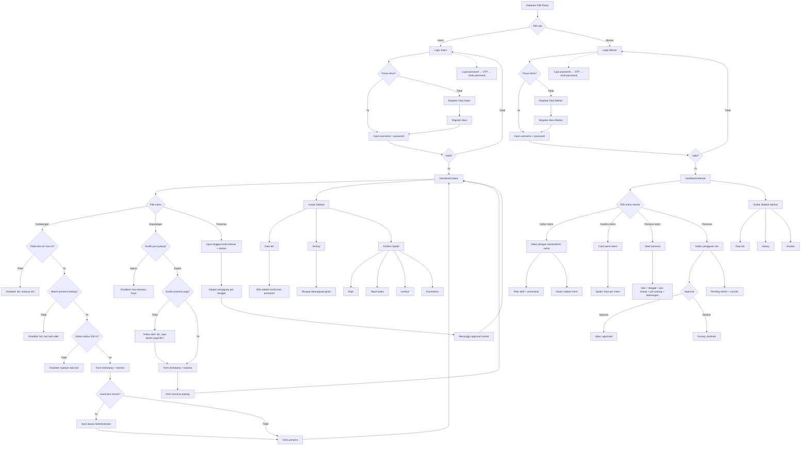

# Flowchart Revisi — Absensi Magang UP3 Serpong

Flowchart awal sudah mencakup dua role (Intern dan Mentor), login/register, presensi datang/pulang/izin, dan analisis spider chart. fileciteturn0file0L3-L18 fileciteturn0file0L87-L112

Berikut versi yang disesuaikan dengan requirement lengkap.

## Perubahan penting dari flowchart awal

1. **OTP reset password** ditambahkan.
2. **Geofence 100 meter** menjadi validasi server, bukan hanya kondisi UI.
3. **Kamera** menjadi bagian wajib untuk bukti presensi.
4. **Alasan keterlambatan** hanya muncul ketika melewati jam masuk.
5. **Perizinan rentang tanggal** dipecah menjadi record harian di database.
6. **Approval mentor** mengubah status menjadi approved/declined.
7. **Sidebar profile** memiliki Data diri, History, Analisis.
8. **Analisis** memiliki empat kriteria: Rajin, Tepat waktu, Lembur, Konsistensi.
9. **Mentor** mendapatkan daftar intern berdasarkan relasi mentor/divisi.
10. **Counter pending approval** ditambahkan pada dashboard mentor.
11. **Kepulangan sebelum jam pulang** dibuat disabled.
12. Jika sudah jam pulang tetapi belum absen pagi, kepulangan tetap dapat dibuka dengan pesan pengingat.
